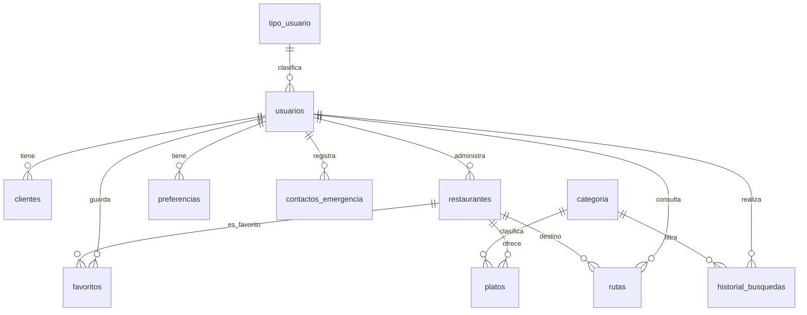

# Base de datos SQLite — TasteGo

TasteGo usa **expo-sqlite** con un único archivo: `miapp.db`. La inicialización ocurre una sola vez al arrancar la app, mediante `SQLiteProvider` y la función `inicializarDB` en `hooks/dataBase.ts`.

---

## Configuración

```tsx
// app/_layout.tsx
<SQLiteProvider databaseName="miapp.db" onInit={inicializarDB}>
```

Pragmas aplicados al inicio:

- `journal_mode = WAL` — mejor concurrencia de lectura/escritura.
- `foreign_keys = ON` — integridad referencial activa.

---

## Diagrama entidad-relación (simplificado)



---

## Tablas

### `restaurantes`

Almacena establecimientos sincronizados desde Overpass o datos locales.

| Columna | Tipo | Notas |
|---------|------|--------|
| `id_restaurante` | INTEGER PK AUTOINCREMENT | |
| `id_usuario` | INTEGER NOT NULL | FK → usuarios |
| `nombre` | TEXT NOT NULL | |
| `descripcion` | TEXT | |
| `tipo_comida` | TEXT | Cuisine / categoría |
| `direccion` | TEXT | |
| `ciudad` | TEXT | |
| `latitud` | REAL | |
| `longitud` | REAL | |
| `imagen_url` | TEXT | URL o referencia |
| `telefono` | TEXT | |
| `horario` | TEXT | |
| `fuente` | TEXT | Default `'local'` |

---

### `usuarios`

| Columna | Tipo | Notas |
|---------|------|--------|
| `id_usuario` | INTEGER PK AUTOINCREMENT | |
| `email` | TEXT UNIQUE | |
| `password` | TEXT NOT NULL | ⚠️ texto plano |
| `id_tipo_usuario` | INTEGER FK | Default: 1 (Ref: `tipo_usuario`) |
| `ubicacion` | TEXT | Añadida por migración `ALTER TABLE` |
| `fecha_registro` | TEXT | Default `CURRENT_TIMESTAMP` |

---

### `clientes`

Datos personales de los usuarios regulares.

| Columna | Tipo | Notas |
|---------|------|--------|
| `id_cliente` | INTEGER PK AUTOINCREMENT | |
| `id_usuario` | INTEGER NOT NULL | FK → usuarios |
| `nombre` | TEXT NOT NULL | |
| `fecha_nacimiento` | TEXT | |
| `telefono` | TEXT | |

---

### `tipo_usuario`

| Columna | Tipo | Notas |
|---------|------|--------|
| `id_tipo_usuario` | INTEGER PK AUTOINCREMENT | |
| `tipo_usuario` | TEXT NOT NULL | Ej: 'cliente', 'restaurante', 'sistema' |

---

### `contactos_emergencia`

Contactos de emergencia asociados al usuario (gestionados en Perfil).

| Columna | Tipo | Notas |
|---------|------|--------|
| `id_contacto` | INTEGER PK AUTOINCREMENT | |
| `id_usuario` | INTEGER FK → usuarios | `ON DELETE CASCADE` |
| `nombre` | TEXT NOT NULL | |
| `relacion` | TEXT NOT NULL | Ej. Madre, Esposo |
| `telefono` | TEXT NOT NULL | Usado con `Linking.openURL('tel:...')` |
| `fecha_creacion` | TEXT | Default `CURRENT_TIMESTAMP` |

---

### `preferencias`

Preferencias gastronómicas por usuario.

| Columna | Tipo |
|---------|------|
| `id_preferencia` | INTEGER PK |
| `id_usuario` | INTEGER FK → usuarios |
| `tipo_comida` | TEXT |
| `fecha_actualizacion` | TEXT |

---

### `categoria`

Categorías de platos (p. ej. `regional`, `local`).

| Columna | Tipo |
|---------|------|
| `id_categoria` | INTEGER PK |
| `nombre` | TEXT NOT NULL |
| `descripcion` | TEXT |

---

### `platos`

| Columna | Tipo | Notas |
|---------|------|--------|
| `id_plato` | INTEGER PK | |
| `id_restaurante` | TEXT FK | |
| `id_categoria` | INTEGER FK | |
| `nombre` | TEXT | |
| `descripcion` | TEXT | |
| `precio` | REAL | |
| `imagen_url` | TEXT | Ruta o asset |
| `modelo_3d_url` | TEXT | Clave en `MODELS` |
| `disponible` | INTEGER | 1 = disponible |

**Datos demo**: `insertarDemos()` inserta platos colombianos (mote de queso, bandeja paisa, etc.) para cada restaurante cargado.

---

### `favoritos`

| Columna | Tipo |
|---------|------|
| `id_favorito` | INTEGER PK |
| `id_usuario` | INTEGER FK |
| `id_restaurante` | TEXT FK |
| `fecha_guardado` | TEXT |

**Restricción**: `UNIQUE (id_usuario, id_restaurante)` — un favorito por par usuario-restaurante.

---

### `historial_busquedas`

| Columna | Tipo |
|---------|------|
| `id_busqueda` | INTEGER PK |
| `id_usuario` | INTEGER FK (nullable) |
| `id_categoria` | INTEGER FK (nullable) |
| `tipo_comida` | TEXT |
| `ciudad` | TEXT |
| `latitud` / `longitud` | REAL |
| `fecha_busqueda` | TEXT |

---

### `rutas`

Historial de consultas de ruta hacia un restaurante.

| Columna | Tipo |
|---------|------|
| `id_ruta` | INTEGER PK |
| `id_usuario` | INTEGER FK (nullable) |
| `id_restaurante` | TEXT FK |
| `origen_latitud` / `origen_longitud` | REAL |
| `destino_latitud` / `destino_longitud` | REAL |
| `distancia_texto` | TEXT |
| `duracion_texto` | TEXT |
| `medio_desplazamiento` | TEXT |
| `fecha_consulta` | TEXT |

---

## Índices

| Índice | Tabla | Columna(s) |
|--------|-------|------------|
| `idx_platos_restaurante` | platos | `id_restaurante` |
| `idx_favoritos_usuario` | favoritos | `id_usuario` |
| `idx_historial_usuario` | historial_busquedas | `id_usuario` |
| `idx_contactos_usuario` | contactos_emergencia | `id_usuario` |

---

## Migraciones

Tras crear las tablas, `inicializarDB` ejecuta:

```sql
ALTER TABLE usuarios ADD COLUMN ubicacion TEXT
```

Si la columna ya existe (instalación previa), el error se ignora silenciosamente.

---

## API del hook `useBaseDeDatos`

Funciones expuestas al resto de la app:

| Método | Descripción |
|--------|-------------|
| `insertarDemos(rest)` | Inserta categorías y platos demo para cada restaurante |
| `registrarUsuario(user)` | Alta; devuelve `{ mensaje, state, usuario }` |
| `iniciarSesion(correo, contraseña, tipo)` | Devuelve datos según rol (cliente o restaurante) o `false` |
| `actualizarUsuario(id, campo, valor)` | Actualiza `nombre`/`telefono` en `clientes`, o `email`/`ubicacion` en `usuarios` |
| `agregarContactoEmergencia(id, contacto)` | INSERT en `contactos_emergencia`; valida campos |
| `listarContactosEmergencia(idUsuario)` | Lista ordenada por fecha descendente |
| `agregarFavoritos(idRest, idUser)` | INSERT en favoritos |
| `eliminarFavoritos(idRest, idUser)` | DELETE |
| `estaEnFavoritos(idRest, idUser)` | `boolean` |
| `listarFavoritosUsuario(idUsuario)` | JOIN restaurantes + favoritos |
| `listarMenuRestaurante(idRest)` | Platos del restaurante |
| `obtenerUsuarioCorreo(email)` | Usuario por email |
| `obtenerUsuarioPorId(id)` | Usuario por ID |
| `registrarRestaurantes(restaurante)` | Alta; geocodifica dirección y crea usuario |
| `registrarPlato(plato)` | Alta de nuevo plato en base de datos para el restaurante |
| `actualizarRestaurante(idRestaurante, campo, valor)` | Actualiza un campo del restaurante |
| `obtenerCategorias()` | Obtiene la lista de categorías |

Acceso directo: `db` (instancia `SQLiteDatabase`) e `isReady: true` cuando el provider está montado.

Documentación de uso en pantallas: [MODULOS_HOME_PERFIL_BD.md](./MODULOS_HOME_PERFIL_BD.md).

---

## Consultas típicas en pantallas

### Detalle de restaurante

```sql
SELECT
  id_restaurante AS id,
  nombre AS name,
  descripcion AS description,
  tipo_comida AS cuisine,
  latitud AS latitude,
  longitud AS longitude,
  imagen_url AS image,
  telefono AS phone,
  direccion AS address,
  horario AS openingHours
FROM restaurantes
WHERE id_restaurante = ?
```

### Menú

```sql
SELECT * FROM platos WHERE id_restaurante = ?
```

### Favoritos del usuario

```sql
SELECT r.id_restaurante AS id, r.nombre AS nombre,
       r.imagen_url AS image, r.ciudad, r.telefono
FROM restaurantes r
INNER JOIN favoritos f ON r.id_restaurante = f.id_restaurante
WHERE f.id_usuario = ?
```

### Home — listado de restaurantes

```sql
SELECT
  id_restaurante AS id, nombre AS name, descripcion AS description,
  tipo_comida AS cuisine, direccion AS address, ciudad,
  latitud AS latitude, longitud AS longitude,
  imagen_url AS image, telefono AS phone, horario AS openingHours, fuente
FROM restaurantes
```

### Home — upsert desde Overpass

```sql
INSERT OR REPLACE INTO restaurantes
  (id_restaurante, nombre, descripcion, tipo_comida, direccion, ciudad,
   latitud, longitud, imagen_url, telefono, horario, fuente)
VALUES (?,?,?,?,?,?,?,?,?,?,?,?)
-- fuente = 'api'
```

### Perfil — contactos de emergencia

```sql
SELECT * FROM contactos_emergencia
WHERE id_usuario = ?
ORDER BY fecha_creacion DESC
```

### Perfil — actualizar campo de usuario

```sql
UPDATE usuarios SET {campo} = ? WHERE id_usuario = ?
-- campo ∈ nombre | email | telefono | ubicacion
```

---

## AsyncStorage (complemento)

No forma parte de SQLite pero almacena estado de sesión y AR:

| Clave | Uso |
|-------|-----|
| `sesion` | JSON del usuario o restaurante logueado |
| `ubicacionUsuario` | Última ubicación cacheada |
| `moldelRA` | Clave del modelo 3D para AR/VR |

---

## Mejoras recomendadas para producción

1. Hashear contraseñas antes de `INSERT` en `usuarios`.
2. Migraciones versionadas (tabla `schema_version` + scripts incrementales).
3. Cifrar `miapp.db` en dispositivos sensibles.
4. Sincronizar favoritos y usuarios con un API REST si se añade backend.
