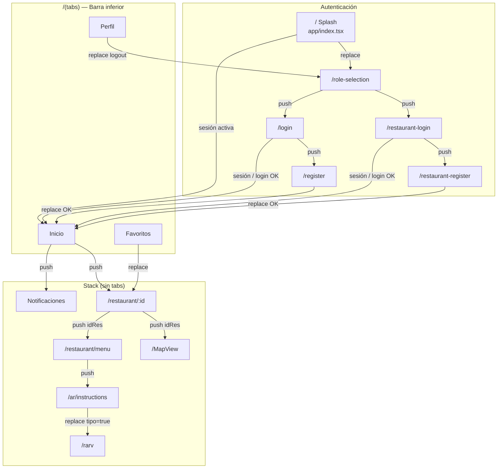
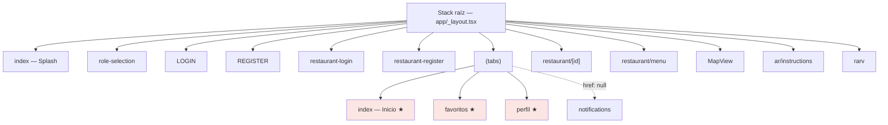
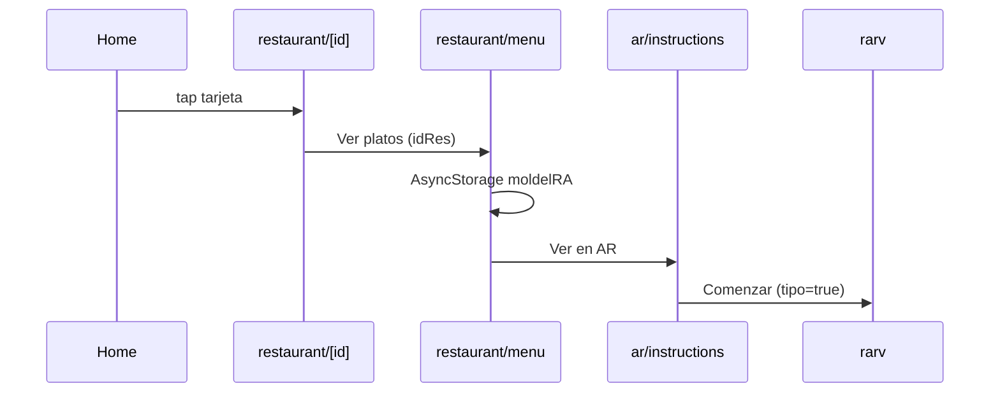

# Diagrama de pantallas — TasteGo

Mapa de navegación basado en **Expo Router** (archivos en `app/`). Las flechas indican transiciones con `router.push`, `router.replace` o `router.back`.

**Inventario actual:** 12 pantallas activas (sin plantillas ni rutas huérfanas).

---

## Vista general (flujo principal)



---

## Estructura de navegación (árbol)



★ = visible en la barra inferior.

---

## Pestañas

| Pantalla | Ruta | Tab visible | Acceso |
|----------|------|-------------|--------|
| Inicio | `/(tabs)/index` | Sí | Tras login |
| Favoritos | `/(tabs)/favoritos` | Sí | Tab |
| Perfil | `/(tabs)/perfil` | Sí | Tab |
| Notificaciones | `/(tabs)/notifications` | No (`href: null`) | Campana en Home |

---

## Flujo restaurante → AR



---

## Inventario de pantallas

| Ruta | Archivo | Descripción |
|------|---------|-------------|
| `/` | `app/index.tsx` | Splash animado → check sesión → `HOME` o `/role-selection` |
| `/role-selection` | `app/role-selection.tsx` | Selección de rol (Usuario / Restaurante) |
| `/login` | `app/login.tsx` | Inicio de sesión de Usuario |
| `/register` | `app/register.tsx` | Registro de usuario |
| `/restaurant-login` | `app/restaurant-login.tsx` | Inicio de sesión de Restaurante |
| `/restaurant-register` | `app/restaurant-register.tsx` | Registro de restaurante |
| `/(tabs)` | `app/(tabs)/index.tsx` | Home: sync Overpass/SQLite, búsqueda por cocina |
| `/(tabs)/favoritos` | `app/(tabs)/favoritos.tsx` | Favoritos del usuario |
| `/(tabs)/perfil` | `app/(tabs)/perfil.tsx` | Edición de perfil, contactos de emergencia, logout |
| `/(tabs)/notifications` | `app/(tabs)/notifications.tsx` | Notificaciones (sin tab) |
| `/restaurant/[id]` | `app/restaurant/[id].tsx` | Detalle del restaurante |
| `/restaurant/menu` | `app/restaurant/menu.tsx` | Menú y platos |
| `/MapView` | `app/MapView.tsx` | Mapa y ruta (OSRM) |
| `/ar/instructions` | `app/ar/instructions.tsx` | Tutorial antes de AR |
| `/rarv` | `app/rarv.tsx` | Visor 3D AR/VR (`ModelViewer`) |

---

## Transiciones

| Desde | Hacia | Método |
|-------|--------|--------|
| Splash | Role Selection | `replace` (si no hay sesión) |
| Splash | Tabs (Home) | `replace` (si hay sesión activa) |
| Role Selection | Login | `push` |
| Login / Res Login | Tabs (Home) | `push` / `replace` |
| Login / Res Login | Registro | `push` |
| Registro | Tabs | `replace` |
| Perfil | Role Selection | `replace` (logout) |
| Home | Notificaciones | `push` |
| Home | `/restaurant/:id` | `push` |
| Favoritos | `/restaurant/:id` | `replace` |
| Detalle | Menú, MapView | `push` + `idRes` |
| Menú | Instrucciones AR | `push` |
| Instrucciones | rarv | `replace` + `tipo=true` |

---

## Leyenda

| Símbolo | Significado |
|---------|-------------|
| `push` | Apila pantalla (atrás disponible) |
| `replace` | Sustituye la pantalla actual |
| Línea punteada | Ruta sin icono en tab bar |

---

## Árbol de archivos (`app/`)

```
app/
├── _layout.tsx
├── index.tsx
├── login.tsx
├── register.tsx
├── MapView.tsx
├── rarv.tsx
├── (tabs)/
│   ├── _layout.tsx
│   ├── index.tsx
│   ├── favoritos.tsx
│   ├── perfil.tsx
│   └── notifications.tsx
├── restaurant/
│   ├── [id].tsx
│   └── menu.tsx
└── ar/
    └── instructions.tsx
```
