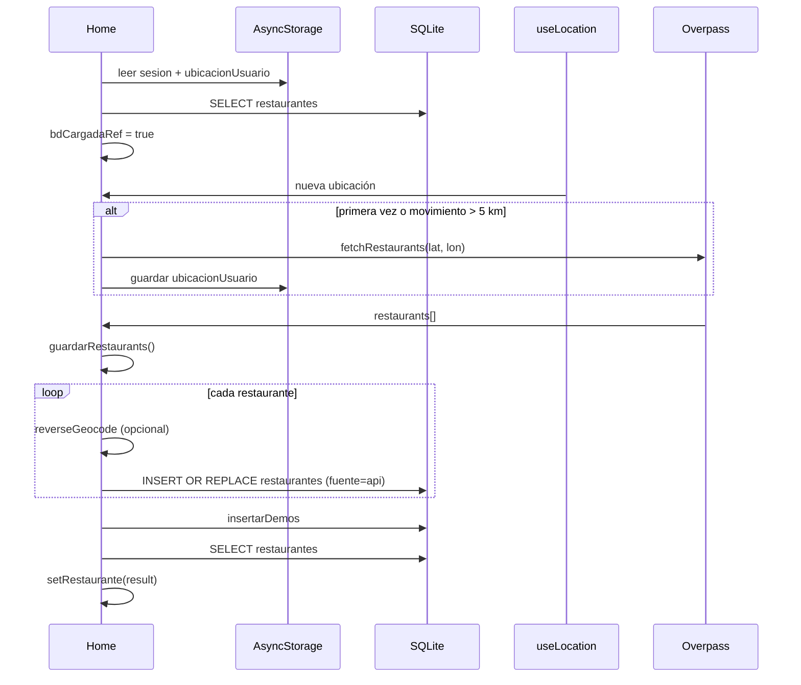
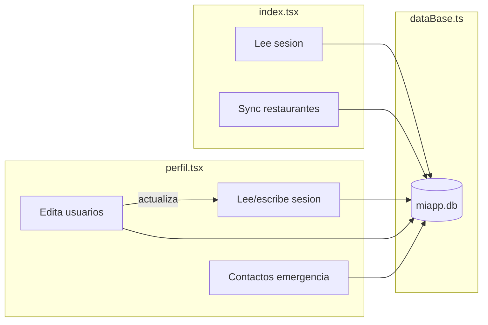

# Módulos principales: Home, Perfil y Base de datos

Documentación detallada de `app/(tabs)/index.tsx`, `app/(tabs)/perfil.tsx` y `hooks/dataBase.ts`.

---

## `hooks/dataBase.ts`

Capa de persistencia local. Expone `inicializarDB` (ejecutada una vez por `SQLiteProvider`) y el hook `useBaseDeDatos()` para el resto de la app.

### Tipos exportados

| Tipo | Campos relevantes |
|------|-------------------|
| `Usuarios` | `id_usuario`, `nombre`, `email`, `password`, `fecha_nacimiento`, `telefono`, `ubicacion?` |
| `CampoUsuario` | `'nombre' \| 'email' \| 'telefono' \| 'ubicacion'` |
| `Platos` | Plato del menú con `modelo_3d_url` para AR |
| `Favoritos` | Vista JOIN restaurante + favorito |
| `ContactoEmergencia` | `id_contacto`, `id_usuario`, `nombre`, `relacion`, `telefono` |
| `ContactoEmergenciaInput` | `nombre`, `relacion`, `telefono` (sin ID) |

### Inicialización (`inicializarDB`)

- Crea 9 tablas: `restaurantes`, `usuarios`, `preferencias`, `categoria`, `platos`, `favoritos`, `historial_busquedas`, `rutas`, `contactos_emergencia`.
- Aplica índices en `platos`, `favoritos`, `historial_busquedas` y `contactos_emergencia`.
- **Migración en caliente**: intenta `ALTER TABLE usuarios ADD COLUMN ubicacion TEXT` (ignora error si la columna ya existe).

### API de `useBaseDeDatos()`

| Método | Retorno | Descripción |
|--------|---------|-------------|
| `insertarDemos(rest)` | `void` | Categorías `regional`/`local` y platos demo por restaurante |
| `registrarUsuario(user)` | `{ mensaje, state }` | Valida email único y crea cliente |
| `iniciarSesion(correo, pass, tipo)` | `Usuarios \| RestauranteI \| false` | Login por email, contraseña y rol |
| `actualizarUsuario(id, campo, valor)` | `{ mensaje, state, usuario? }` | Edita campos del perfil (`clientes`/`usuarios`) |
| `registrarRestaurantes(rest)` | `{ mensaje, state, restaurante }` | Modifica DB y usuarios para alta de un nuevo restaurante |
| `actualizarRestaurante(id, campo, valor)` | `{ mensaje, state, restaurante? }` | Actualiza cuenta o detalles del restaurante |
| `registrarPlato(plato)` | `void` | Permite agregar un plato |
| `obtenerCategorias()` | `Categorias[]` | Obtiene las categorías de la tabla `categoria` |
| `agregarContactoEmergencia(id, contacto)` | `{ mensaje... }` | Valida campos no vacíos para emergencia |
| `listarContactosEmergencia(id)` | `ContactoEmergencia[]` | Ordenados por `fecha_creacion DESC` |
| `agregarFavoritos` / `eliminarFavoritos` | `void` | CRUD favoritos |
| `estaEnFavoritos` | `boolean` | Verifica existencia |
| `listarFavoritosUsuario` | `Favoritos[]` | Listado de restaurantes favoritos |
| `listarMenuRestaurante` | `Platos[]` | Recupera el menú de base de datos |
| `obtenerUsuarioCorreo` / `obtenerUsuarioPorId` | `Usuarios?` | Consultas de usuario específicas |
| `db` | `SQLiteDatabase` | Acceso directo para consultas |
| `isReady` | `true` | Siempre listo tras montar el provider |

---

## `app/(tabs)/index.tsx` — Home

Pantalla principal tras el login. Combina datos locales (SQLite), APIs externas (Overpass, geocodificación) y UI de descubrimiento.

### Dependencias

| Módulo | Uso |
|--------|-----|
| `useBaseDeDatos` | Lectura/escritura de `restaurantes`, `insertarDemos` |
| `useLocation` | Coordenadas GPS del dispositivo |
| `useRestaurants` | Fetch Overpass (radio 5 km) |
| `reverseGeocode` | Dirección legible si OSM no trae `addr:street` |
| `getDistanceInMeters` | Detectar si el usuario se movió > 5 km |
| `AsyncStorage` | `sesion`, `ubicacionUsuario` |

### Flujo de datos (3 efectos encadenados)

**Reglas de refresco API:**

- Primera ubicación: siempre llama a Overpass.
- Siguientes: solo si la distancia respecto a `ubicacionUsuario` guardada supera **5000 m**.
- Usa `lastFetchRef` (ref, no estado) para evitar lecturas stale.

### UI y secciones

| Sección | Fuente de datos | Navegación |
|---------|-----------------|------------|
| Header | `user.nombre` desde `sesion` | Campana → `/(tabs)/notifications` |
| SearchBar | Estado local `busquedaCocina` | Filtra en cliente |
| Banner promocional | Estático (mock) | Sin acción |
| «Los más visitados» | Array `popularRestaurants` (mock IDs 1–3) | `/restaurant/:id` |
| «Más restaurantes» | SQLite vía `restaurante` + filtro | `/restaurant/:id` |

### Búsqueda por tipo de comida

- Función `filtrarPorCocina`: normaliza texto (minúsculas, sin acentos) y filtra por `restaurant.cuisine`.
- `useMemo` sobre `restaurantesFiltrados`.
- Estados vacíos: loader mientras `loadingRe` o `restaurante.length === 0`; mensaje si el filtro no coincide.

### Persistencia al guardar restaurantes

Campos por defecto cuando Overpass no los trae:

- `descripcion`: texto genérico sobre comida típica regional.
- `tipo_comida`: `"Tipica"` si no hay `cuisine`.
- `telefono`: `"8569435741"`.
- `fuente`: `"api"`.

Tras guardar, ejecuta `insertarDemos` para poblar menús demo.

---

## `app/(tabs)/perfil.tsx` — Perfil

Gestión del perfil del usuario logueado, contactos de emergencia y cierre de sesión.

### Dependencias

| Módulo | Uso |
|--------|-----|
| `useBaseDeDatos` | `actualizarUsuario`, `agregarContactoEmergencia`, `listarContactosEmergencia` |
| `AsyncStorage` | Clave `sesion` (lectura al montar, escritura al editar) |
| `Linking` | Llamadas telefónicas `tel:` |

### Carga inicial

1. Lee `sesion` de AsyncStorage → `setUser`.
2. Si hay usuario, `listarContactosEmergencia(id_usuario)` → `setContactos`.

### Secciones de la pantalla

#### Información personal (editable)

Campos tocables que abren un **Modal** de edición:

| Campo | Teclado | Persistencia |
|-------|---------|--------------|
| Nombre | default | `actualizarUsuario` → SQLite + `sesion` |
| Correo | email | Valida unicidad de email |
| Teléfono | phone-pad | |
| Ubicación | default | Columna `ubicacion` en `usuarios` |

Flujo `guardarCampo`: `actualizarUsuario` → si OK, actualiza estado local y `AsyncStorage.setItem('sesion', ...)`.

#### Contactos de emergencia

- Lista tarjetas con nombre, relación y teléfono.
- Botón **+ Agregar** → modal con 3 campos (`nombre`, `relacion`, `telefono`).
- `agregarContactoEmergencia` → recarga lista.
- Botón **Llamar** → `Linking.openURL('tel:...')`.
- Estado vacío con mensaje instructivo.

#### General (placeholders)

Opciones visuales sin navegación implementada:

- Configuración
- Ayuda y soporte
- Términos y condiciones
- Privacidad

#### Cerrar sesión

- `AsyncStorage.removeItem('sesion')`
- `router.replace('../login')`

### Modales internos

La pantalla usa `Modal` de React Native (no la ruta `/modal` eliminada):

1. Edición de campo de perfil.
2. Alta de contacto de emergencia.

Ambos con `KeyboardAvoidingView` en iOS.

---

## Relación entre los tres módulos

| Clave AsyncStorage | Escritura | Lectura |
|------------------|-----------|---------|
| `sesion` | login, register, perfil (editar) | home, perfil, favoritos, detalle |
| `ubicacionUsuario` | home (tras fetch GPS) | home (umbral 5 km) |
| `moldelRA` | menú | rarv |
